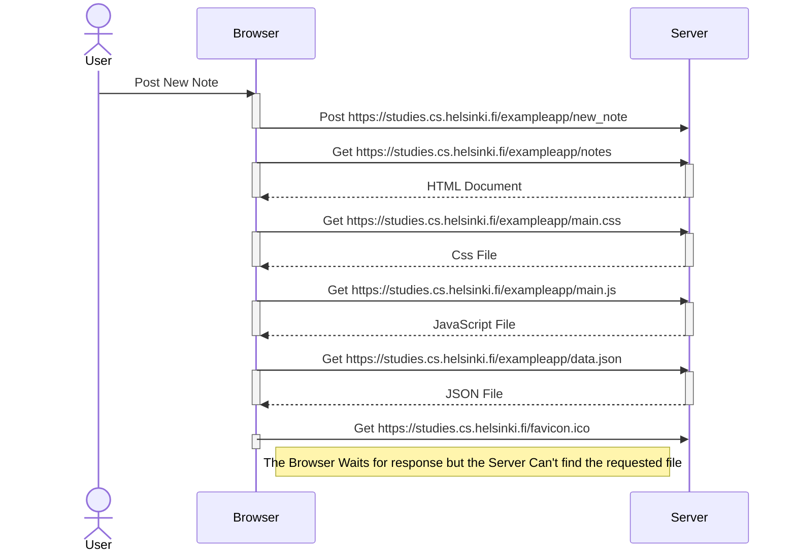

```mermaid
sequenceDiagram
Actor User
Participant Browser
Participant Server
User->>Browser:Post New Note

Activate Browser
Browser->>Server:Post https://studies.cs.helsinki.fi/exampleapp/new_note
Deactivate Browser

Browser->>Server:Get https://studies.cs.helsinki.fi/exampleapp/notes
Activate Browser
Activate Server
Server-->>Browser:HTML Document
Deactivate Browser
Deactivate Server

Browser->>Server:Get https://studies.cs.helsinki.fi/exampleapp/main.css
Activate Browser
Activate Server
Server-->>Browser: Css File
Deactivate Browser
Deactivate Server

Browser->>Server:Get https://studies.cs.helsinki.fi/exampleapp/main.js
Activate Browser
Activate Server
Server-->>Browser:JavaScript File
Deactivate Browser
Deactivate Server

Browser->>Server:Get https://studies.cs.helsinki.fi/exampleapp/data.json
Activate Browser
Activate Server
Server-->>Browser:JSON File
Deactivate Browser
Deactivate Server

Browser->>Server:Get https://studies.cs.helsinki.fi/favicon.ico
Activate Browser
Deactivate Browser
Note Right of Browser:The Browser Waits for response but the Server Can't find the requested file

```