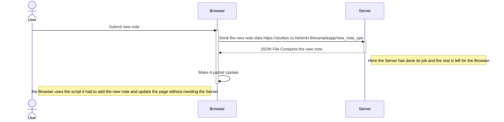

```mermaid
sequenceDiagram

Actor User
Participant Browser
Participant Server

User->>Browser:Submit new note
Activate Browser
Browser->>Server:Send the new note data https://studies.cs.helsinki.fi/exampleapp/new_note_spa
Activate Server
Server-->>Browser:JSON File Containts the new note
Deactivate Server
Note Right of Server:Here the Server has done its job and the rest is left for the Browser
Browser->>Browser:Make A partial Update
Deactivate Browser
Note Left of Browser:the Browser uses the script it had to add the new note and update the page without needing the Server 

```